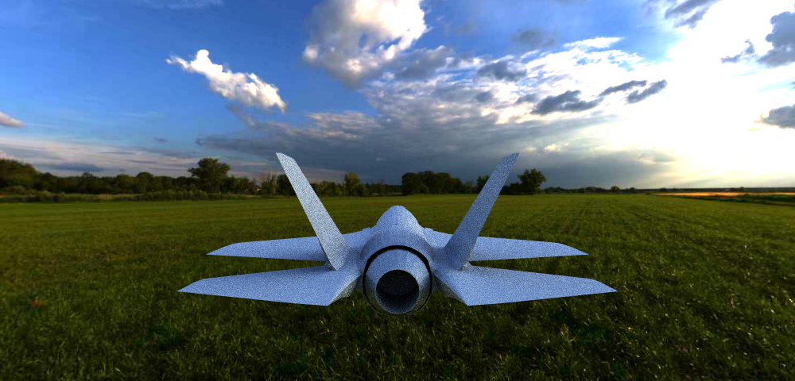
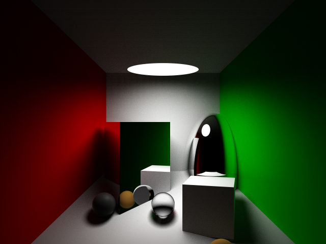
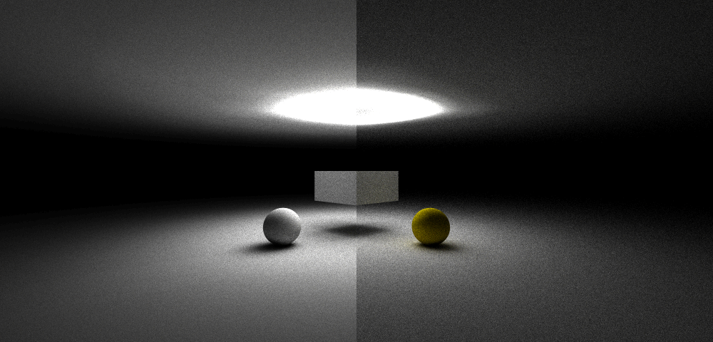
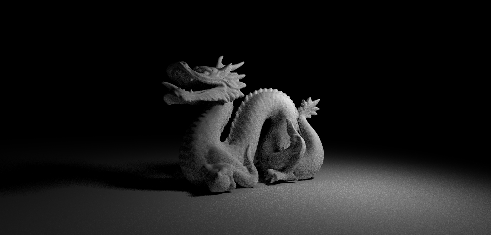

# Yart-cpp
Yart stands for "yet another ray tracer". This is a simple ray tracer implemented in `C++`.

Thanks [Johnson](https://github.com/phisiart) for creating the UI.

Just for fun. Build it!

-----------------------------------------------

## Windows

### Prerequisites

- Visual Studio 2015 (for some `C++14` features).
- Cgywin with flex, bison and make installed.
- Download [FreeImage](http://freeimage.sourceforge.net/) and make sure VS can find it.

### Parser

Open Cgywin terminal and change to the repo directory.

```bash
> cd src
> make
```

### Main

Simply open the VS solution and build it. This should give you no warning.

## Ubuntu

### Prerequisites

- Clang++ (or g++ supporting `C++14` features).
- Flex, bison for the parser.
- CMake as the build system.
- Download [FreeImage](http://freeimage.sourceforge.net/) source code, compile it and make install.

### Parser

Exactly the same as in Windows.

```bash
> cd src
> make
```

###  Main

Build the main program is simple. Make sure your linker can find FreeImage library.

```bash
> mkdir build
> cd build
> cmake ..
> make
```

And that's it!

How to use it?
----------------------------------------------
To use it, simply type the following command in terminal. At the end of this file you can find a fully commented scene description file as an example. You can find more examples in the `test` folder.

```bash
> yart-cpp.exe scene.yart
```

Objects
----------------------------------------------
All the objects used in yart inherit from the abstract class `Object`, which defines an interface including `intersect`, `occlude` and other APIs.

Basically the yart system supports only two kinds of objects: sphere and mesh. There are other objects only for inner use such as BBox(bounding box), but you should not define such an object in the scene description file.

### Sphere

Spere is defined with a radius and a center. Notice that it will be transformed by the transform matrix currently in the stack. So you can define ellipse by applying a scale transform on a sphere. For intersection test, the ray is first transformed into the sphere coordinate and do intersection test.
Then the result is transformed back into world coordinate.

### Mesh

Mesh is the object you should use to represent any object that can't be represented by sphere 
(since the system supports only two kinds of objects). A mesh is composed of many triangles. 
You can use plan triangles whose normal is uniform everwhere, or you can refine the mesh and calculate a normal for each vertex. When a ray hits the mesh, the normals is calculated by weighting the normals of the three vertex. This usually smooth the mesh.

Lights
----------------------------------------------
All the lights offer an interface to do intersection test, to return the emission radiance, to sample a point on the light and return the pdf of sampling a specific point. 

### Point light

A point light is defined with its position and radiance. It's a uniform light and will never be intersected with a ray.

### Area light

Area light is a circle light. It takes four parameters: center, radius, normal direction and power.

### Environment light

Environment light is a sphere wrapped around the whole scene. You can find a lot spheric texture online. Here is a simple demo:



BSDF
----------------------------------------------
The BSDF offers the following interface:

- bsdf(intersection, in, out) -> the bsdf function value
- sample(intersection)        -> samples an outgoing ray according to a pdf
- pdf(intersection, out)      -> the probability in projected solid angle of the outgoing ray.

Notice that BSDF base class provides a default implementation of `sample` and `pdf` fuctions, which samples according to a cosin-like pdf.

### Lambertian

The lambertian BSDF reflects the incoming light in all direction uniformly. It's value is always one over pi. The normalized pdf is `1/PI`. It uses the default sampling strategy.

### Specular

The specular BSDF represents perfect reflection. Notice that there is a delta function in the pdf and bsdf value, which leads to problem when calculating the weight of this path in bidirectional path tracing. Here we use idea from veach's [thesis](https://graphics.stanford.edu/papers/veach_thesis/) that return values of pdf and bsdf methods are the coefficients of a delta fuction. The probability of a path should be set to zero if there is a delta function in the denominator.

### Refraction

The refraction BSDF represents the perfect refraction module. Just like the specular BSDF, there is a delfa function in pdf and bsdf, which need to be handled carefully.

### Cook-Torrance

Cook-Torrance BSDF is used to model the glossy material.

This Cornell box image shows an example for different materials.



Pixel Sampler
----------------------------------------------
Pixel sampler is used to generate rays for a pixel. It is important because without it there would be jaggies.

### Uniform Sampler

A uniform pixel sampler will break a pixel into some small subpixels and shoot one ray for each subpixels. The mean of the returned color of these rays is the color of this pixel. This reduces the jaggies but cannot elminate them.

### Jittered Sampler

Just like the uniform sampler, the jittered sampler also breaks one pixel into subpixels. However, instead of shooting one ray from the center of the subpixel, the origin of the ray is chosen randomly inside the subpixel. Generally this is better than uniform sampler due to the randomness.

### Adaptive Sampler

The Adaptive Sampler uses a Jittered Sampler to generate some samples first and evaluates the result. The result is compared with the previous one and if the difference is trivial, it terminates. This helps the ray tracer generates more samples for the pixel which converges slower. It can also dump the samples per pixel matrix to `spp.dat`.

Integrator
----------------------------------------------
The integrator is used to solve the lighting equation, which is actually an integral.

### Direct Light Integrator

This integrator use multiple importance sampling to sovle the integral. It has two parameters: maxDepth for the recursion depth, nBSDFSamples for the number of samples taken for BSDF.
It samples the light and the BSDF to get a lower variance. For the weight function, it uses power heuristics. Compare with the simple ray tracing which samples the BSDF only at mirror reflection, this integrator may introduce more noise. But it is a general unbiased integrator.

### Bidirectional Path Integrator

The bidirectional path tracer in [veach's thesis](https://graphics.stanford.edu/papers/veach_thesis/) is implemented. This tracer samples the path by connecting two subpaths, one starting from the light and one from the camera. It performs much better than unidirectional path tracer when the scene is illuminated by indirect light, which are unlikely to be sampled by unidirectional path tracer. Just as mentioned in specular BSDF, special attention is needed to handle the delta function in pdf and bsdf.

Bidirectional path tracer performs much better than direct light integrator when most of the scene is lighted by indirect light. Here is an image to illustrate this difference.

- Left: bidirectional, light subpath 2, eye subpath 2, pixel samples 32, time 325s
- Right: direct light, depth 2, light samples 4, bsdf samples 4, pixel samples 32, time 674s

We can see that it takes much more time for direct light integrator to render the image. What's more, direct light integrator can't handle indirect light well, which makes the image darker.



Scene Description File
----------------------------------------------
Here is a real scene description file with comments. You can find more examples in the `/test` folder. I really like this one:



```txt
# Stanford Dragon
size 1000 480

# Set the camera at (-10, 5, 20), look at (0, -1, 0),
# up vector (0, 1, 0), fovy is 45 degree.
camera -10 5 20 0 -1 0 0 1 0 45

# Set the output file name.
output "stanford-dragon.png"

# Use bidirectional path integrator,
# with 6 bounces on eye subpath and 6 bounces on light subpath.
integrator "BidirectionalPath" 6 6

# Use adaptive pixel sampler.
# Split one pixel into  a 4x4 grid and takes 16 samples each time.
# Minimum samples: 16
# Maximum samples: 1024
# Terminate threshold: 0.0005
pixelSampler "AdaptivePixelSampler" 4 16 1024 0.0005

# Start to define the world.
worldBegin

    # One area light at (10, 10, 10), with power (100, 100, 100),
    # normal vector (-15, -10, -10), radius 2
    areaLight 10 10 10 100 100 100 -15 -10 -10 2

    # Another area light.
    areaLight -10 7 -10 100 100 100 5 -7 10 2

    # Start to define the back wall.
    objBegin "Mesh"

        # Set the material to specular.
        material "Specular"

        # Save the current transform stack.
        pushTransform

        # Translate to z - 15 and scale it.
        translate 0 0 -15
        scale 100 100 1

        # Define the four corner of the wall.
        v -1 -1 0
        v -1 1 0
        v  1 1 0
        v  1 -1 0

        # Define the face of the wall in counter clockwise order.
        f 2 1 3
        f 4 3 1

        # Restore the transform stack.
        popTransform

    # Finish defining the back wall.
    objEnd

    # Front wall.
    objBegin "Mesh"
        # Set the color to gold.
        material "Lambertian" 1 0.843 0
        pushTransform
        translate 0 0 25
        scale 100 100 1
        v -1 -1 0
        v -1 1 0
        v  1 1 0
        v  1 -1 0
        f 1 2 3
        f 3 4 1
        popTransform
    objEnd

    # Right wall.
    objBegin "Mesh"
        material "Specular"
        pushTransform
        translate 15 0 0
        scale 1 100 100
        v 0 -1 -1
        v 0 -1 1
        v 0 1 1
        v 0 1 -1
        f 1 2 3
        f 3 4 1
        popTransform
    objEnd

    # Left wall.
    objBegin "Mesh"
        material "Lambertian" 1 0.843 0
        pushTransform
        translate -15 0 0
        scale 1 100 100
        v 0 -1 -1
        v 0 -1 1
        v 0 1 1
        v 0 1 -1
        f 2 1 3
        f 4 3 1
        popTransform
    objEnd

    # Ceil.
    objBegin "Mesh"
        material "Lambertian" 1 1 1
        pushTransform
        translate 0 20 0
        scale 100 1 100
        v -1 0 -1
        v -1 0 1
        v  1 0 1
        v  1 0 -1
        f 2 1 3
        f 4 3 1
        popTransform
    objEnd

    # Ground.
    objBegin "Mesh"
        material "Lambertian" 1 1 1
        pushTransform
        translate 0 -5 0
        scale 100 1 100
        v -1 0 -1
        v -1 0 1
        v  1 0 1
        v  1 0 -1
        f 1 2 3
        f 3 4 1
        popTransform
    objEnd

    # The first glass dragon.
    objBegin "Mesh"
        # Set the refraction index to 1.5
        material "Refraction" 1.5
        pushTransform
        translate -7 -1.9 1
        scale 5 5 5

        # Include the simplified dragon obj file.
        include "objs/dragon-simplified.obj"
        popTransform

        # Refine the mesh with normal interpolation.
        refineMesh

        # Build a 12 level OCTree to accelerate the intersection test with this mesh.
        buildOCTree 12
    objEnd

    objBegin "Mesh"
        # Set the material to Cook-Torrance with
        # color (5, 5, 5), kd 0.2, ks 0.8, rough 0.3, n 1.5
        material "CookTorrance" 5 5 5 0.2 0.8 0.3 1.5
        pushTransform
        translate 3 -1.9 8
        scale 5 5 5
        include "objs/dragon-simplified.obj"
        popTransform
        #refineMesh
        buildOCTree 12
    objEnd

# Finish defining the world.
worldEnd
```
